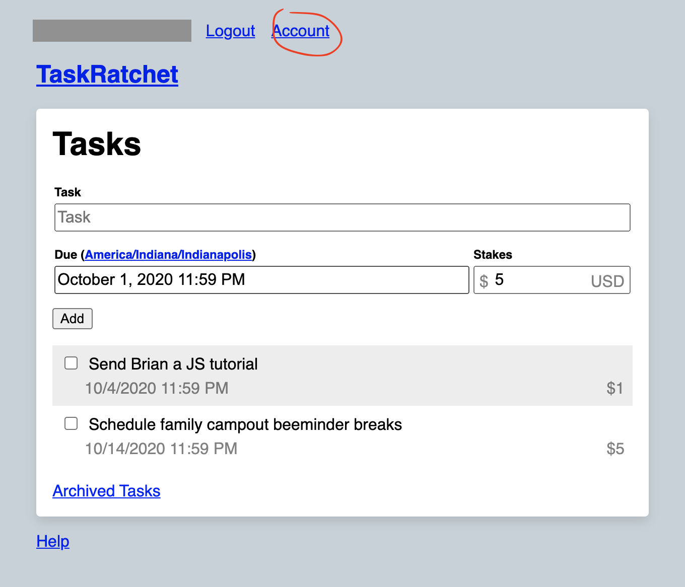
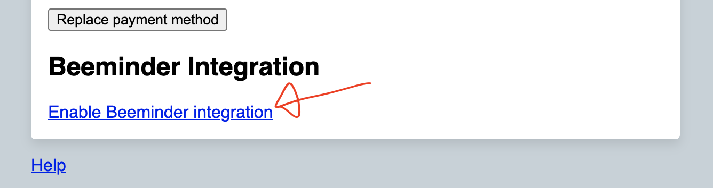
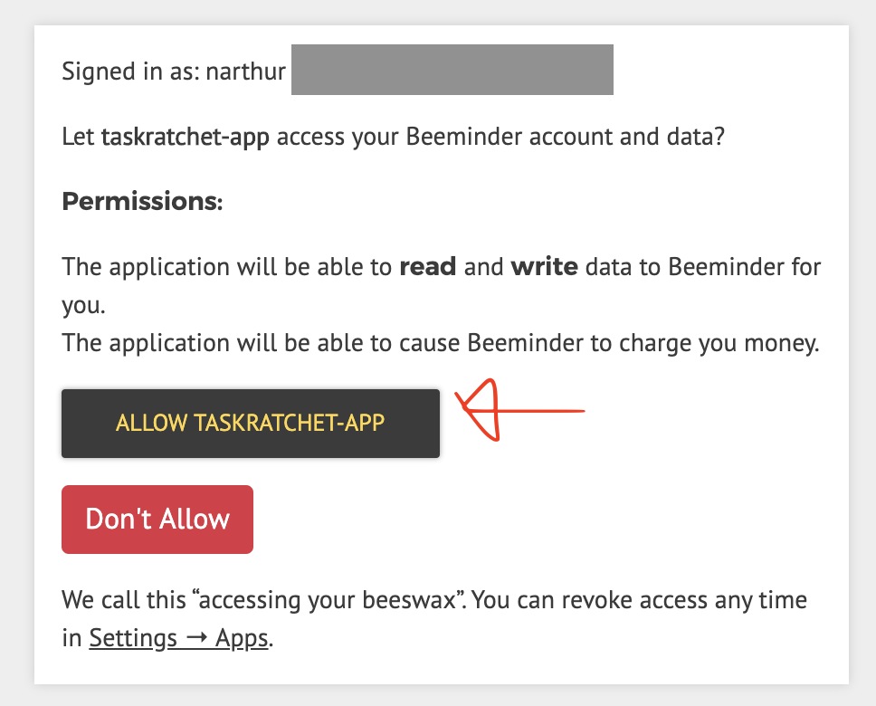
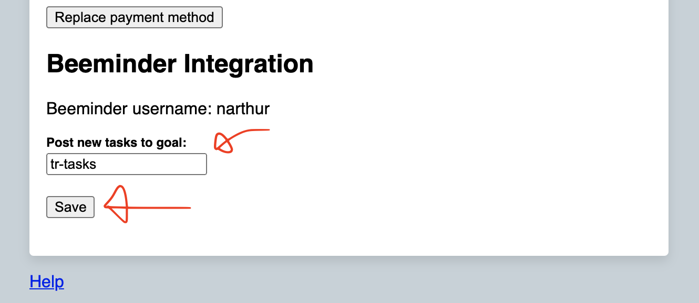

# Integrations

## Beeminder

<Video url="https://www.youtube.com/embed/Y_2F9MOD6Bg" />

### Features

Enabling the Beeminder integration gives you three new features:

Feature                                      | Format
---------------------------------------------|----------------------------
Post all new tasks to Beeminder on creation  | Applies to all new tasks
Post to Beeminder goal(s) on task creation   | `[Task Name] &[Goal Slug]`
Post to Beeminder goal(s) on task completion | `[Task Name] *[Goal Slug]`

When a task is posted to Beeminder as a new datapoint, the following attributes are set:

Datapoint Field | Value
----------------|--------------
Date            | Date task was added, or completed if using `*`-tag
Value           | Always `1`
Comment         | Task summary, e.g., `The Task by 3/24/2021, 11:59 PM or pay $10.00`

#### Examples

> Go shopping

On **creation** of the task, the default Beeminder goal you specified in your settings will receive a datapoint of 1.

> Go shopping &shopping

On **creation** of the task, your `shopping` Beeminder goal will receive a datapoint of 1, in addition to your default goal.

> Go shopping &shopping &chores

On **creation** of the task, your `shopping` and `chores` goals will both receive a datapoint of 1, in addition to your default goal.

> Go shopping \*shopping

On **completion** of the task, your `shopping` Beeminder goal will receive a datapoint of 1. In addition, your default goal will receive a datapoint of 1 when the task was created.

> Go shopping \*shopping &chores

On **creation** of the task, your `chores` Beeminder goal will receive a datapoint of 1, in addition to your default goal.

On **completion** of the task, your `shopping` Beeminder goal will receive a datapoint of 1.

#### Enable Beeminder Integration

To enable the integration, first navigate to your account settings.

Click "Enable Beeminder integration."

You'll be redirected to Beeminder's website. Grant TaskRatchet access to your Beeminder account.

You'll be redirected back to your account settings. Add the name of the Beeminder goal you'd like TaskRatchet to post
your new tasks to, then click "Save."

Now, whenever you add a new task, a 1 will be posted to the goal you specified in your account settings.

In addition, you can add a `&goal-name` tag to a task's name to post to a goal on task create, and `*goal-name`
to post to the goal on task complete.

### Further Reading

- [Explain Purpose of the “Task Ratchet App” Integration with Beeminder?](https://forum.beeminder.com/t/explain-purpose-of-the-task-ratchet-app-integration-with-beeminder/10288)
- [TaskRatchet help page at Beeminder](https://help.beeminder.com/article/289-taskratchet)
