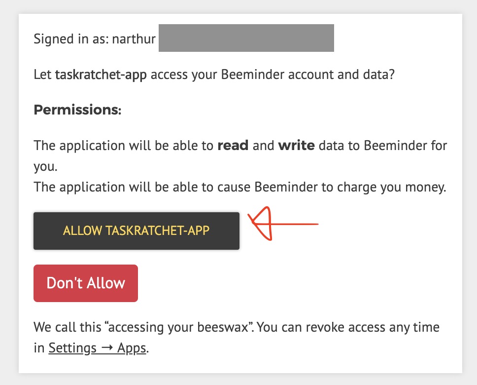
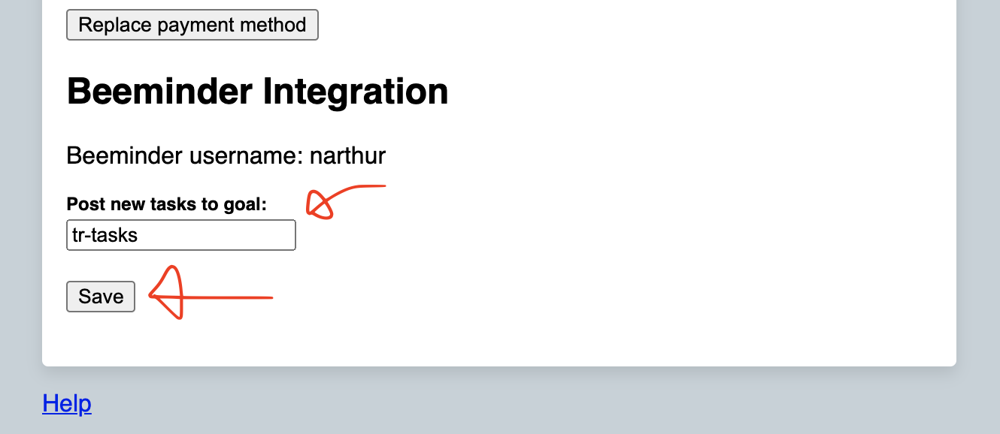

# Integrations

## Beeminder

<Video url="https://www.youtube.com/embed/Y_2F9MOD6Bg" />

### Features

The Beeminder integration lets you track your TaskRatchet activity in Beeminder. You can:

1. Send all new tasks to your default Beeminder goal
2. Send specific tasks to specific goals using `&[goal]` in the task name
3. Send task completions to goals using `*[goal]` in the task name

Examples:
- `Buy groceries` - Sends to your default goal when created
- `Buy groceries &shopping` - Also sends to your "shopping" goal when created  
- `Buy groceries *shopping` - Sends to your "shopping" goal when completed

Each datapoint sent to Beeminder includes:
- Value: Always 1
- Date: When the task was created (or completed for *-tags)
- Comment: Task details including deadline and stakes

#### Enable Beeminder Integration

To enable the integration, first navigate to your account settings.

Click "Enable Beeminder integration."

You'll be redirected to Beeminder's website. Grant TaskRatchet access to your Beeminder account.

You'll be redirected back to your account settings. Add the name of the Beeminder goal you'd like TaskRatchet to post
your new tasks to, then click "Save."

Now, whenever you add a new task, a 1 will be posted to the goal you specified in your account settings.

In addition, you can add a `&goal-name` tag to a task's name to post to a goal on task create, and `*goal-name`
to post to the goal on task complete.

### Further Reading

- [Explain Purpose of the “Task Ratchet App” Integration with Beeminder?](https://forum.beeminder.com/t/explain-purpose-of-the-task-ratchet-app-integration-with-beeminder/10288)
- [TaskRatchet help page at Beeminder](https://help.beeminder.com/article/289-taskratchet)
